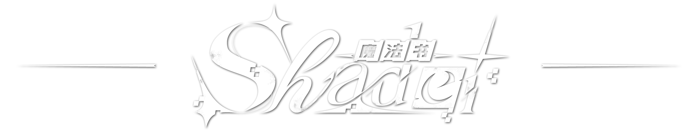
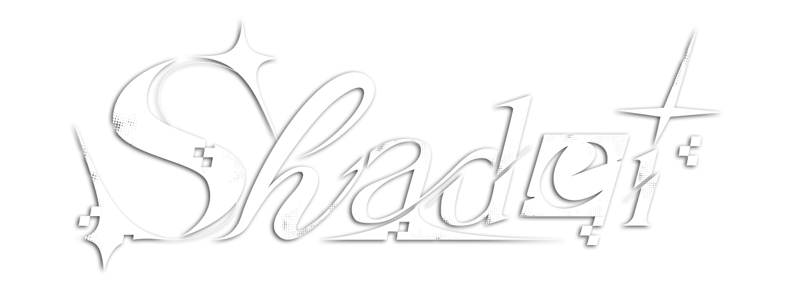

<h1 align="center">
  
   
  欢迎来到Shader魔法书
</h1> 

  <b>一本记录Shader “咒语”灵感 的 “魔法书”</b>
   
  <i>A repository for recording Shader code and creative inspiration</i>

  <b>仓库分享的Shader适用以下创作平台：</b>

  
  &nbsp;
  
  &nbsp;
  
  &nbsp;
  
  

<i>
  ……

  Shader「魔法书」—— 你的像素级咒语文库

  这里没有羊皮卷与水晶球，却藏着比咒语更玄妙的代码；

  这里不供奉魔法石与龙息，却流淌着比咒语更炽热的像素。

  欢迎踏入「Shader魔法书」—— 全宇宙最野的Shader代码仓库，

  一个让GPU集体起立鼓掌、让画面党疯狂分泌多巴胺的「视觉炼金坊」。
</i>

  

---

## ✨ 仓库简介
<blockquote>
  魔法书介绍
</blockquote>

&emsp;&emsp;个人🍭云端Shader代码仓库，用来记录在各个游戏引擎中玩过的Shader，同时也作为自己渲染向TA学习过程的记录。

&emsp;&emsp;渲染风格一般为 **三渲二/卡通渲染** 的风格。嘿嘿~ 主要因为个人非常喜欢二次元卡通风格🍧，特别对角色人物卡渲尤为钟爱😻。

&emsp;&emsp;仓库上传的Shader计划会按照 **制作内容**（即Shader实现的具体视觉效果或功能目标）分类，Shader的类型会更贴近实际开发中的需求场景，主要围绕 **“​渲染什么​​”** 或 **“​​解决什么视觉问题​​”** 展开，计划涵盖：
- 材质表现类Shader​
- 视觉效果类Shader​
- 渲染流程支持类Shader
- 调试与工具类Shader​
- 特殊渲染类Shader​

&emsp;&emsp;仓库除存储Shader外，还会有 **[引擎渲染合集](引擎渲染合集/Readme.md)** 版块，记录一些个人学习过程中渲染相关的练习作品，一般为 **引擎实时渲染** 出图，如地编场景渲染、灯光布光思路、角色卡通渲染、三渲二等，欢迎查看🍬！

## 💡 仓库补充
<blockquote>
  魔法书补充
</blockquote>

&emsp;&emsp;此仓库开源、免费，采用 **[GPLv3]** 开源协议，**仅供个人学习与交流使用，请勿用于任何商业或营利性目的！**

&emsp;&emsp;为什么要开源？因为Shader的魅力在于 **“用代码创造视觉魔法”** 😻，但独乐乐不如众乐乐——

&emsp;&emsp;此仓库一方面作为个人🍭云端 **游戏引擎渲染相关创作** 的代码备份仓库，另一方面分享出来也作为TA渲染🎨相关技术的知识分享，供有幸能看到此仓库的有缘人💘学习交流使用。

&emsp;&emsp;本人励志想做 **一位合格的TA** ，目前还在不断努力学习当中💪。仓库记录的都是自己学习过程中玩过的Shader整合，由于自己能力与理解的不足，代码内容可能会出现错误内容🙀，如果你发现错误，也欢迎来指正！若有专业人士进行补充，也是本仓库的荣幸😽！

&emsp;&emsp;特别感谢我学习过程中遇到的每一位教学老师，也感谢每一位有幸看到这个仓库并愿意花时间阅读、使用、改进这里的开发者 ~~（如果有的话）~~ 💖！

**<i>最后，愿这些“代码”能点亮你的创作，让我们一起用Shader构建更绚丽的世界吧！</i>**

## 🔎 “食用”方法
<blockquote>
  魔法书使用方法
</blockquote>

&emsp;&emsp;<b>仓库内容介绍📌</b>

- 仓库里的 **[万象幻典.md](万象幻典.md)** 为<i>Shader分类清单</i>，记录仓库所有已上传的 **Shader/工程的名称、分类和内容** ，方便查找。
- 每个上传的Shader效果都会新建一个文件夹，文件名为对应Shader效果/内容，按照 **创作平台/软件 - 制作内容（Shader效果）** 分类，打开对应的code文件夹查阅即可。
- 每个Shader文件夹内都会有一个 **Readme.md** 文件，简述该文件/项目的内容和引擎实时渲染效果。
- 该项目仓库除Shader代码文件以外，可能还会存储如 **自定义渲染管线、工程资产文件、引擎脚本** 等等，可按照文件类型区分。

&emsp;&emsp;<b>如何使用？🚀</b>

- ​直接复用​​：代码/资产适配主流引擎（Unreal Engine、Unity，具体看文件），开箱即用或稍作修改；
- ​灵感参考​​：从简单的“UI渐变背景”到复杂的“角色卡渲”，看代码文件/工程文件，逐步拆解Shader逻辑，学习思路，再用到自己的Shader里；
- ​贡献创意​​：哪怕是一个小效果的改进、一点代码的优化、一行注释的优化，都欢迎你的指正和讨论！

## 📜 技术解析
<blockquote>
  咒语原理
</blockquote>

- Shader涉及的着色语言/脚本语言：HLSL、GLSL、ShaderLab。
- 本仓库所用创作平台：
  - Unreal Engine 5.x
  - Unity 2022.3.62
  - Blender 3.x/4.x
  - JetBrains Rider 2025
  - Visual Studio Code 2025

  

## 🔗 常用传送门
<blockquote>
  魔法传送阵
</blockquote>

  - Unreal Engine下载：[https://www.unrealengine.com/zh-CN/download](https://www.unrealengine.com/zh-CN/download) 
  - Unreal Engine官方学习资料：[https://dev.epicgames.com/community/unreal-engine/learning](https://dev.epicgames.com/community/unreal-engine/learning)

  - Unity / Built in Shaders下载：[https://unity.cn/releases](https://unity.cn/releases)
  - Unity官方学习文档：[https://docs.unity.cn/cn/2022.3/Manual/UnityManual.html](https://docs.unity.cn/cn/2022.3/Manual/UnityManual.html)

  - Shadertoy：[https://www.shadertoy.com](https://www.shadertoy.com)

  - Blender：[https://www.blender.org](https://www.blender.org)

## 💖 仓库标题字设
<blockquote>
  魔法书标题字体设计
</blockquote>

- 另一版仓库标题字体设计😎

  

<i>
  ……

  写Shader的人，谁没为调一个参数熬过夜？

  谁没对着屏幕骂过「这破光照怎么就是不对」？

  但在这里——

  搜到一段能用的代码，像捡到了魔法师的私藏火柴；

  看到别人的创意，像偷看到了隔壁巫师的实验笔记；

  而当你自己的Shader被别人收藏时……

  恭喜，你成了别人魔法书里的「传奇咒语作者」。

  所以，别再让GPU在默认着色器里混日子了。

  打开「Shader魔法书」，

  让你的代码开始施法——

  毕竟，这世界缺的从来不是光，

  而是会用Shader写光的人。
</i>

<h3> 
<i>
  —— 愿你的每一行Shader，都能在屏幕上点燃一片星河 ——
</i>
</h3>

