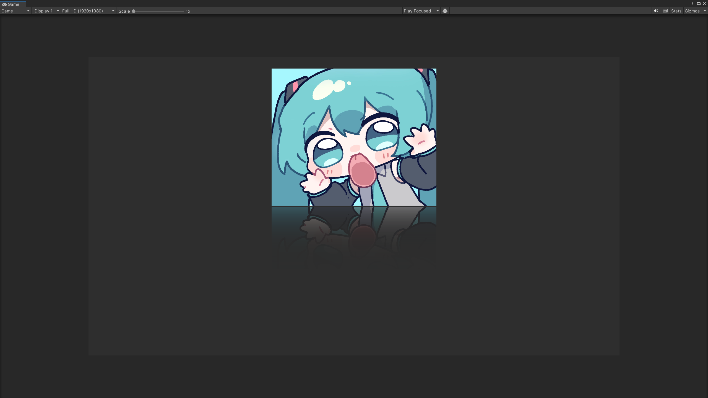
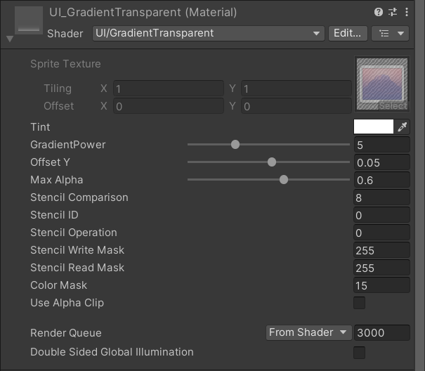

## Unity-UI图片渐变透明度

引擎版本：Unity 2022.3.62

Unity2022.3.62_​Shader_UI

### 内容

&emsp;&emsp;基于Unity的builtin_shaders的UI代码，实现可调节的UI图片渐变透明度效果，可用于模拟图像倒影

&emsp;&emsp;Shader使用方式：复制一份图片，调整位置，添加Shader

### Shader文件

&emsp;&emsp;Shader文件为Unity的​ShaderLab文件

- UI-GradientTransparent.shader：图片渐变透明度Shader

> PS：Unity ShaderLab文件，导入项目Assets文件夹内使用
>
> 或者直接参考代码思路

### 内容预览

> 引擎渲染效果

> Shader参数预览

