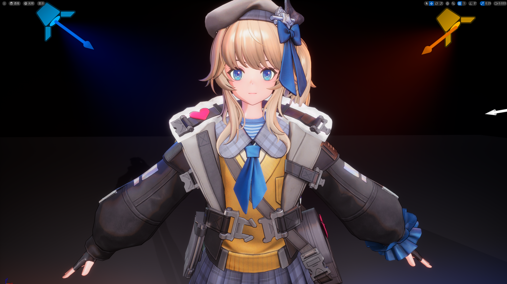
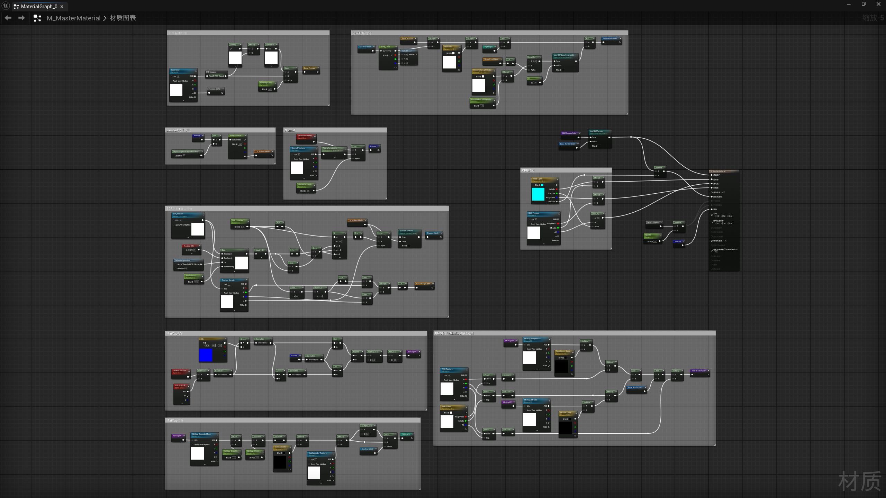

## UE - 仿少女前线2 角色卡通渲染研究_测试

[**返回目录🍭**](/万象幻典.md)

引擎版本：UE 5.5.4

UE5.5.4_ToonRender_GF2Render_NPR+PBR_Blueprint+HLSL

### 内容

&emsp;&emsp;仿 **少女前线2** 角色卡通渲染Shader效果测试

&emsp;&emsp;不魔改引擎，基于 **材质蓝图** 与 **HLSL** 着色代码，实现 **NPR** 卡通光照 + **PBR** 物理材质融合渲染，复刻少女前线2角色卡通渲染效果

&emsp;&emsp;最终渲染画面：卡通Shader + 灯光 + 后期处理调色

### 资产

&emsp;&emsp;资产内容为材质蓝图、Ramp曲线、Actor蓝图、HLSL着色代码

- 材质蓝图：贴图校色、Lambert模型、Ramp采样、Normal、SDF、MatCap、RMO、PBR材质、描边
  - M_MasterMaterial_55GF2R.uasset：卡渲主材质
  - M_MasterM_NoNormal_55GF2R.uasset：卡渲主材质（去除法向输出）
  - M_OutLine_55GF2R.uasset：描边材质

- Ramp曲线：阴影二值化、阴影颜色映射、色调映射、SDF阴影位置映射
  - CB_Ramp_55GF2R.uasset：Ramp采样曲线（使用A通道）
  - CB_Ramp_cloth_55GF2R.uasset：衣服二分颜色映射曲线
  - CB_Ramp_Skin_55GF2R.uasset：皮肤二分颜色映射曲线
  - CB_RGB_Mapped_55GF2R.uasset：色调映射曲线
  - CB_SDF_Location_55GF2R.uasset：SDF阴影过渡位置映射曲线
  - CL_Main_Render_55GF2R.uasset：渲染曲线图谱

- Actor蓝图：光照方向控制SDF、添加描边
  - BP_Render_55GF2R.uasset：角色蓝图

- HLSL：去除引擎添加的色调映射、SDF阴影抗锯齿
  - Dummy.hlsl：规避色调映射模块
  - Tonemap.hlsl：规避色调映射模块
  - SDF Blur.hlsl：SDF抗锯齿

> PS：UE资产文件，导入对应UE版本的项目Content文件夹内使用
> 
> 文件名最后的后缀表示 **编写此内容所使用的引擎版本** 和 **渲染风格**
> 
> 后缀：_55GF2R =  “55” 为 “资产为虚幻引擎5.5版本创建” + “GF2R” 为 “少女前线2风格渲染”

### 内容预览

> 引擎实时渲染效果

> 主材质蓝图节点

