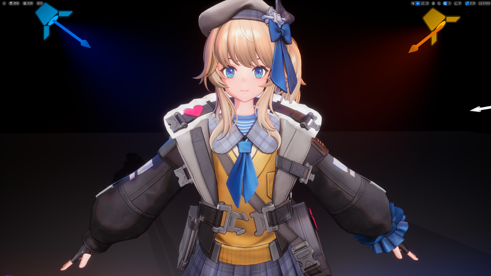
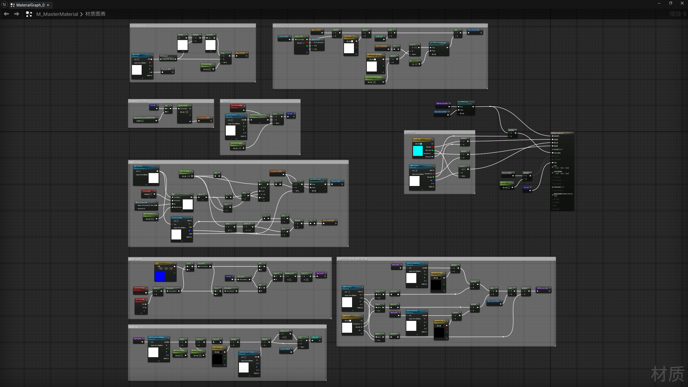

## UE-仿少女前线渲染研究_实验

引擎版本：UE 5.5.4

UE5.5.1_ToonRender_NPR+PBR_Blueprint+HLSL

### 内容

&emsp;&emsp;仿少女前线渲染研究，实验测试版

&emsp;&emsp;不魔改引擎，用蓝图和HLSL着色代码，测试NPR+PBR框架，实现NPR光照模型添加PBR风格化着色

&emsp;&emsp;最终渲染画面：卡通材质+灯光+后期处理调色

### 资产

&emsp;&emsp;资产内容为材质蓝图、Actor蓝图、HLSL着色代码

&emsp;&emsp;材质蓝图：贴图校色、Lambert模型、Ramp采样、Normal、SDF、MatCap、RMO、PBR材质、描边

- M_MasterMaterial_55.uasset：卡渲主材质
- M_MasterM_NoNormal_55.uasset：卡渲主材质（去除法向输出）
- M_OutLine_55.uasset：描边材质
- CB_Ramp_55.uasset：Ramp采样曲线（使用A通道）
- CB_Ramp_cloth_55.uasset：衣服二分颜色映射曲线
- CB_Ramp_Skin_55.uasset：皮肤二分颜色映射曲线
- CB_RGB_Mapped_55.uasset：色调映射曲线
- CB_SDF_Location_55.uasset：SDF阴影过渡位置映射曲线
- CL_Main_Render_55.uasset：渲染曲线图谱

&emsp;&emsp;Actor蓝图：光照方向控制SDF、添加描边

- BP_Render_55.uasset：角色蓝图

&emsp;&emsp;HLSL：去除引擎添加的色调映射、SDF抗锯齿

- Dummy.hlsl：规避色调映射模块
- Tonemap.hlsl：规避色调映射模块
- SDF Blur.hlsl：SDF抗锯齿

> PS：UE资产文件，导入项目Content文件夹内使用
> 
> 文件名最后的数字表示编写此内容所使用的引擎版本

### 内容预览

> 引擎渲染效果

> 材质节点预览

