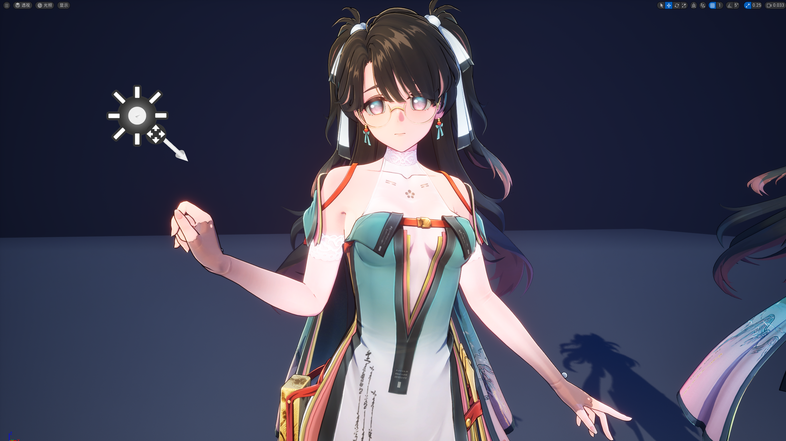
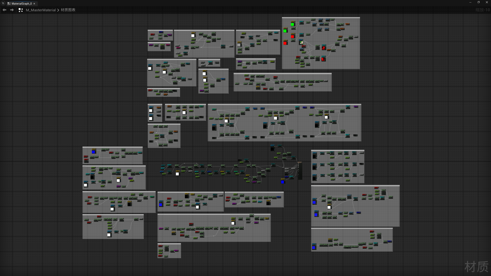

## UE - 仿鸣潮 角色卡通渲染研究_测试

引擎版本：UE 5.5.4

UE5.5.4_ToonRender_WWRender_NPR+PBR_Blueprint+HLSL

### 内容

&emsp;&emsp;仿 **鸣潮** 角色卡通渲染Shader效果测试

&emsp;&emsp;在不魔改引擎的前提下，通过 **材质蓝图** 搭配 **HLSL** 着色代码还原鸣潮角色 **NPR** 渲染风格，同时融入 **PBR** 渲染的艺术表现手法，复刻鸣潮角色卡通渲染效果

&emsp;&emsp;最终渲染画面：卡通Shader + 灯光 + 后期处理调色

### 资产

&emsp;&emsp;资产内容为材质蓝图、Ramp曲线、HLSL着色代码

- 材质蓝图：
- 颜色：基础色、半Lambert、Ramp采样、基础调色、局部调色、阴影交界线颜色、阴影过渡颜色、太阳光颜色、灯光颜色（原管线）、天空光照颜色、环境光颜色
- 阴影：AO阴影、屏幕空间阴影、SDF阴影
- 高光：MatCap、遮罩高光、模型边关、屏幕空间边缘光、Specular、菲尼尔
- 细节：Normal、PBR属性
- 描边：法线外扩描边、摄像机距离调整
  - M_MasterMaterial_55WWR.uasset：卡渲主材质
  - M_MasterMask_55WWR.uasset：遮罩蒙版材质
  - M_TranslucentMask_55WWR.uasset：透明材质
  - M_OutLine_55WWR.uasset：描边材质

- Ramp曲线：阴影二值化样式
  - CB_BinaryRamp_Soft_55.uasset：二分 软阴影
  - CB_BinaryRamp_SlightSoft_55.uasset：二分 微软阴影
  - CB_BinaryRamp_VerySoft_55.uasset：二分 很软阴影
  - CB_BinaryRamp_Haed_55.uasset：二分 硬阴影
  - CB_TernaryRamp_Soft_55.uasset：三分 软阴影
  - CB_TernaryRamp_VerySoft_55.uasset：三分 很软阴影
  - CB_TernaryRamp_Haed_55.uasset：三分 硬阴影
  - CL_MainRender_55.uasset：曲线图谱

- HLSL：去除引擎原本的色调映射、SDF阴影抗锯齿
  - Dummy.hlsl：规避色调映射模块
  - SDF Blur.hlsl：规避色调映射模块
  - Tonemap.hlsl：SDF阴影抗锯齿

> PS：UE资产文件，导入对应UE版本的项目Content文件夹内使用
> 
> 文件名最后的后缀表示 **编写此内容所使用的引擎版本** 和 **渲染风格**
> 
> 后缀：_55WWR =  “55” 为 “资产为虚幻引擎5.5版本创建” + “WWR” 为 “鸣潮风格渲染”

### 内容预览

> 引擎实时渲染效果

> 主材质蓝图节点

