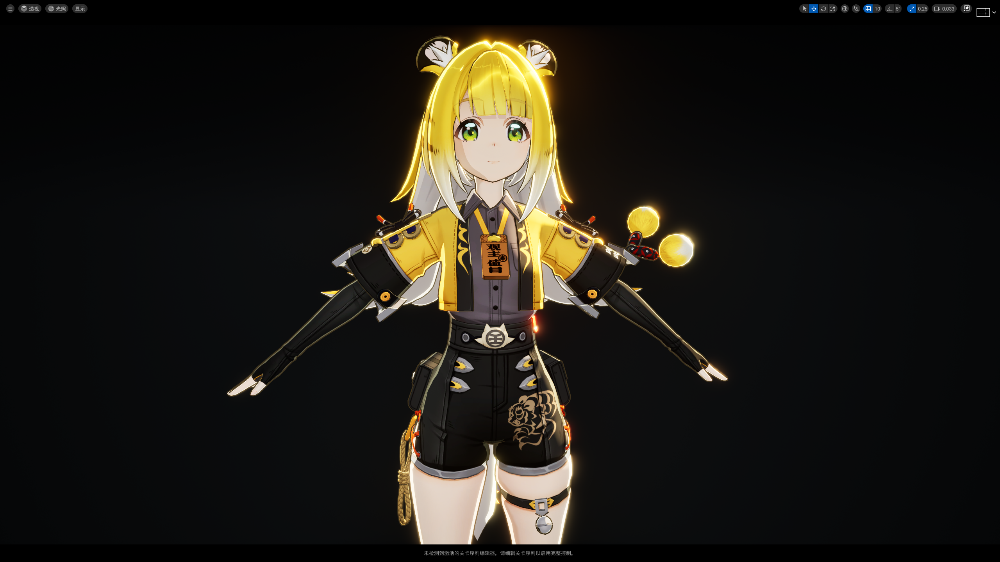
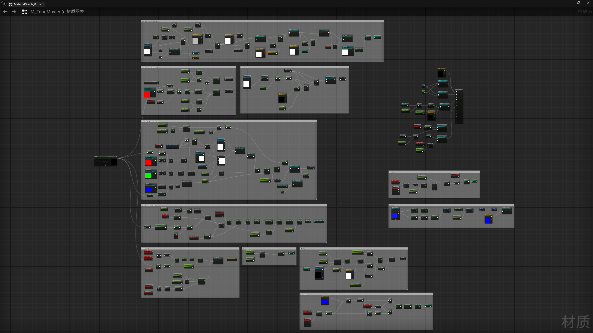

## UE-风格化角色卡通渲染尝试-亮晶晶Jufufu

[**返回目录🍭**](/万象幻典.md)

引擎版本：UE 5.5.4

> **UE5.5.4_ToonRender_StylizedRender_NPR_Blueprint＋HLSL**

### 内容
&emsp;&emsp;超可爱橘福福Jufufu😽角色风格化 **NPR** 卡通渲染创作✨

&emsp;&emsp;基于UE5 **默认渲染管线** 搭建 **非真实感（NPR）** 渲染方案

&emsp;&emsp;融合 **材质蓝图** 与 **HLSL** 着色代码完成 **Shader/材质** 开发；通过卡通材质编写 & 后期处理，打造“亮晶晶”的三渲二视觉效果

&emsp;&emsp;最终渲染画面：卡通Shader/材质 + 后期处理

### 资产

&emsp;&emsp;资产内容为材质蓝图、材质参数集、Actor蓝图&关卡蓝图、HLSL着色代码

- 材质蓝图：
  - 颜色：基础色、色调映射（原色校准）、基础调色、全局色调控制、太阳光颜色
  - 卡通光照：半Lambert模型、卡通明暗二分（阈值阶跃采样）
  - 阴影：AO阴影、SDF阴影、SDF阴影抗锯齿、刘海阴影（正 + 侧面）、屏幕空间阴影
  - 质感：MatCap、Normal贴图
  - 高光与轮廓光：Kajiya-Kay高光、菲涅尔边缘光
  - 动漫细节：眼眉半透效果
  - 描边：法线外扩描边、摄像机距离自适应控制
    - M_ToonMaster_55Styl.uasset：卡渲主材质 + 描边材质
    - M_Eyebrows_55Styl.uasset：眼睛与睫眉半透过效果材质
    - M_Opacity_55Styl.uasset：半透明材质
    - M_PPHairShadow_55Styl.uasset：刘海阴影 **后期处理** 材质
    - M_Vacant_55Styl.uasset：空材质

- 材质参数集：
  - 全局共享参数
    - MPC_Toon_55Styl.uasset：提供的全局共享参数容器，实现材质与蓝图之间参数实时动态传递

- Actor蓝图&关卡蓝图：
  - 提取角色脸部三轴方向向量、提取定向光源颜色
    - BP_Jufufu.uasset：角色Actor蓝图，提取角色脸部三轴向量
    - Main.umap：关卡蓝图，提取定向光源颜色

- HLSL：
  - 提取当前主定向光源的世界空间方向向量、SDF阴影抗锯齿
    - Directional-Light-Direction.hlsl：提取定向光源方向向量
    - SDF-Blur.hlsl：SDF阴影抗锯齿

> PS：UE资产文件，导入对应UE版本的项目Content文件夹内使用
> 
> 文件名最后的后缀表示 **编写此内容所使用的引擎版本** 和 **渲染风格**
> 
> 后缀：_55Styl =  “55” 为 “资产为虚幻引擎5.5版本创建” + “Styl” 为 “风格化渲染”

### 内容预览

> 引擎实时渲染效果

> 主材质蓝图节点

